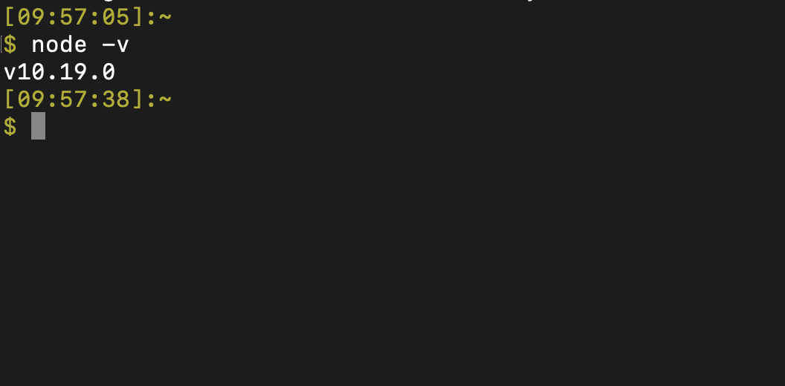
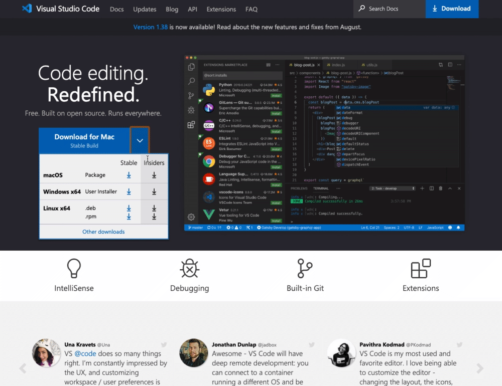
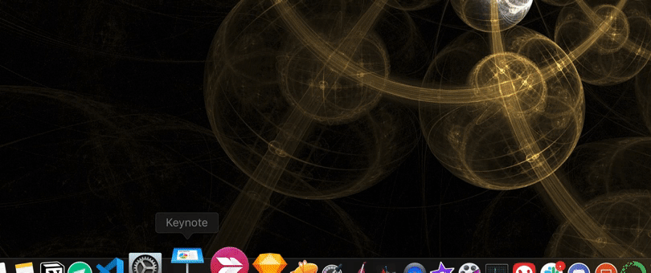
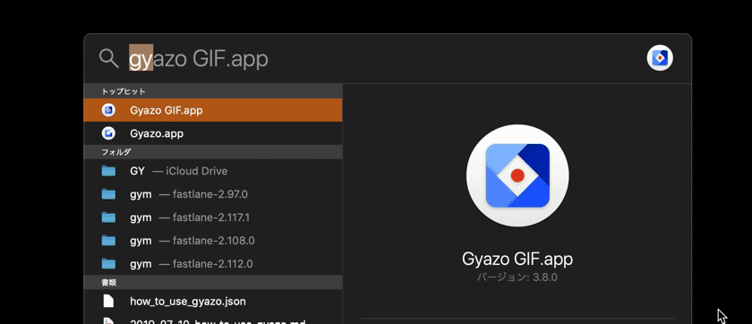
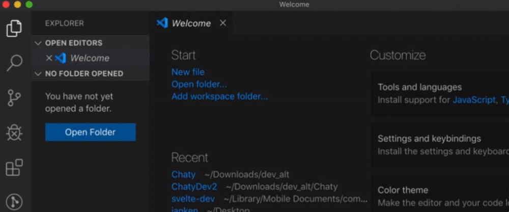
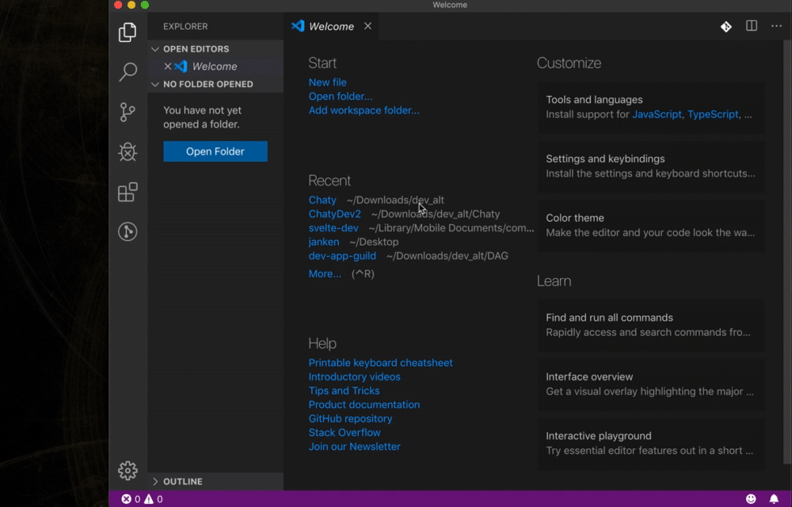
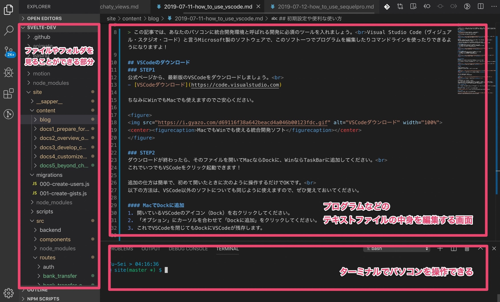
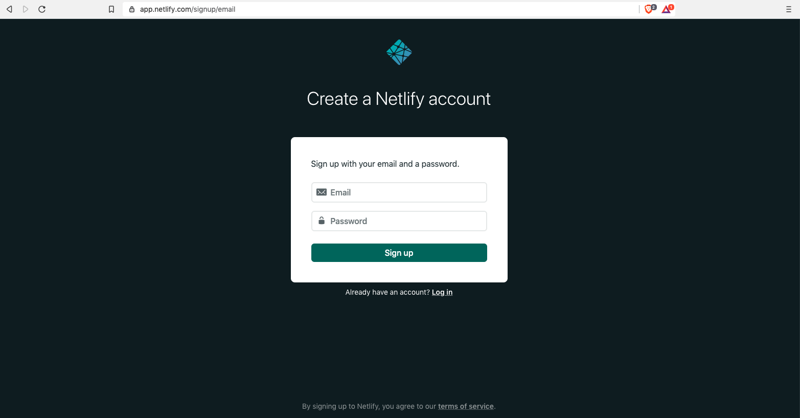

author: Yu-Sei
summary: Reactハンズオンの事前準備
id: how-to-install-nodejs
categories: react,tutorial
environments: Web
status: Published
feedback link: https://github.com/Yu-Sei-M/yu-sei-m.github.io/issues
analytics account:

# 事前準備｜はじめて学ぶReact

## 自分に必要な準備を確認
Duration: 0:02:00

### 目次（事前準備でやること）
- Nodeのインストール
- VSCodeのインストール
- Netlifyのアカウント作成

### はじめに「コマンドライン」を起動しておきます
Nodeをインストールするために、コマンドラインを起動しておきましょう。ターミナルやコマンドプロンプトと呼ばれるマウスのクリックではなくキーボードでパソコンを操作するツールのことです。

Negative
: 指示：はじめに、Macを使用する場合はターミナルを、Winを使用する場合はコマンドプロンプト（またはパワーシェル）を起動してください。

※ わからない人は以下の記事を参照
- [Winコマンドプロンプト](https://www.pc-cafe.jp/%E3%82%B3%E3%83%9E%E3%83%B3%E3%83%89%E3%83%97%E3%83%AD%E3%83%B3%E3%83%97%E3%83%88%E3%80%81%E3%82%B7%E3%82%A7%E3%83%AB%E3%80%81%E3%82%BF%E3%83%BC%E3%83%9F%E3%83%8A%E3%83%AB%E3%81%A8%E3%81%AF%EF%BC%9F/)
- [Macターミナル](https://macmac.jp/macmac127/)

Positive
: 注記：両方とも「コマンドライン」と呼ばれるツールで、Windows（コマンドプロンプト）とMac（ターミナル）でそれぞれ名前が違いますが、同じ役割を持っています。「電子マネーカード」が東京（Suica）と関西（Icoca）で名前が違っていても、同じように現金なしで支払いができるようなものです。

### OS別に現状に合わせた作業スタート地点が異なります

Negative
: 指示：コマンドラインを開いて、下記のコマンドを実行してください。

```console
node -v
```

errorが表示される場合は、あなたのパソコンにはnodeがまだ入っていません。Windowsの方は**記事A**を、Macの方は**記事B（この資料の２ページ目）**を進めてください。

次のようにnodeのバージョンが表示されたらあなたのパソコンにはnodeがインストールされています。10.19.0でない場合は、変更する必要があるため、Windowsの方は**記事C**を、Macの方は**記事D**を進めてください。

Negative
: 指示：記事A~Dのうち自分に該当するものを開き、記事の内容を元にnodeのバージョンを10.19.0にしてください。

| Node有無 | Win | Mac |
| ---------- | ---- | ------ |
| まだない | [記事A](https://techfun.cc/javascript/nodejs.html) | [記事B](https://yu-sei-m.github.io/how-to-install-nodejs/#1) |
| 入ってる | [記事C](https://qiita.com/satoyan419/items/56e0b5f35912b9374305) | [記事D](https://qiita.com/bigplants/items/2d75bf552e0da4a7e822) |

記事BのMacでNodeを使ったことがない人のみこの資料の２ページ目で解説しています。他の記事は外部記事になります。

Positive
: 注記：nodebrewなどすでに使っているバージョン管理ソフトがある方はご自身が利用しているもので10.19.0に設定してください。

### 記事A~Dのいずれかを作業した後にもう一度チェックします

Negative
: 指示：コマンドラインを開いて、下記のコマンドを実行してください。

```console
node -v
```

以下のように出力されていれば問題ありません。



## 【記事B】 Nodeのインストール（Mac）
Duration: 0:05:00

今回は、**エンジニアが仕事で開発するときに限りなく近い状態でハンズオンを実施**します。初心者だからと仕事をする時とは違う簡易な方法で学ぶのは挫折を先送りできるメリットがある一方で、全体で見ると効率が悪いためです。環境構築は始めたての人にとってはかなり難易度の高い作業ですが、なるべく丁寧に完了までの道筋を整理したので、ぜひ頑張って乗り越えてください。

Positive
: 注記：このページは記事Bです。Macの方でNodeが入っていない人の作業の解説です。記事A,C,Dの作業を完了してnodeのバージョンが10.19.0の人は次に進んでください。

### 【このページでやること】
- Homebrewのインストール
- Nodeのインストール
- Nodeのバージョン管理ツールのインストール
- Nodeのバージョンを変更

Positive
: 補足：Homebrew（ホームブルー）は、コマンドラインで利用できるツールをインストールするツールです。つまり、HomebrewはMac（またはLinux）がデフォルトで備えていない便利なコマンドを導入できます。

Negative
: 指示：次の５つのコマンドを順番にターミナルで実行してください。

`Homebrewのインストール`
```console
/bin/bash -c "$(curl -fsSL https://raw.githubusercontent.com/Homebrew/install/master/install.sh)"
```

`nodeのインストール`
```console
brew install node
```

`nのインストール`
```console
npm -g i n
```

`nodeのバージョン変更`
```console
sudo n 10.19.0
```

`nodeのバージョン確認`
```console
node -v
```

最後の実行結果が以下のように出力されていれば問題ありません。


## VSCodeのインストール
Duration: 0:05:00

今回のハンズオンではVSCodeを利用します。

Positive
: このページはVSCodeが入っていない人のための解説をしています。普段から使っている人は次に進んでください。使い方も説明していますが、ハンズオンで口頭で説明するので時間がない方はインストールのみでも構いません。

### VSCodeのダウンロード
#### STEP1
Negative
: 指示：公式ページから、最新版のVSCodeをダウンロードしましょう。
- [VSCodeダウンロード](https://code.visualstudio.com)

ちなみにWinでもMacでも使えますのでご安心ください。


#### STEP2
Negative
: 指示：ダウンロードが終わったら、そのファイルを開いてMacならDockに、WinならTaskBarに追加してください。

これでいつでもVSCodeをクリック起動できます！
追加の仕方は簡単で、初めて開いたときに次のように操作するだけでOKです。

以下の方法は、VSCode以外のソフトについても同じように使えますので、ぜひ覚えておいてください。

##### MacでDockに追加する手順
1. 開いているVSCodeのアイコン（Dock）を右クリックしてください。
2. 「オプション」にカーソルを合わせて「Dockに追加」をクリックしてください。
3. これでVSCodeを閉じてもDockにVSCodeが残存します。



##### WinでTaskBarに追加する手順
1. 開いているVSCodeのアイコン（TaskBar）を右クリックしてください。
2. 「タスクバーに追加」をクリックしてください。
3. これでVSCodeを閉じてもTaskBarにVSCodeが残存します。


### 起動と画面の説明
#### STEP3
Macの人はDockの、Winの人はTaskBarのVSCodeをクリックして起動してください。
ちなみにMacの場合は、`command + space` で表示される検索バーに「VSC」と入力してエンターを押してもすぐに起動できます。



#### STEP4
こちらはVSCodeの画面です。
この短い動画と同じように操作して同じ画面にしてください。
まずは、左バーの上のボタンを押してフォルダ一覧をみれるようにしましょう。



次にターミナル（Terminal）を開きます。
このVSCodeの下側の部分でパソコンをコマンドで操作できます。
（パソコンのコマンド操作をしたことがない人は、意味がわからなくてもまだ大丈夫です）



実際のフォルダを開くと、次のようになります。



左側にディレクトリの中身が表示され、新規作成やコピー、削除の他、名前の変更などの操作が可能になっています。

右側の上のスペースは、プログラムファイルにコードを記述するときにエディターとして使うスペースです。
右側の下には、主にコマンドラインを表示し、各種コマンドを実行します。

### おつかれ様でした！
VSCodeのインストールはこれで完了です。次に進みましょう。

## Netlifyアカウント作成
Duration: 0:02:00

今回のハンズオンではNetlify（ネットリファイ）を利用します。

Positive
: 注記：このページはNetlifyのアカウントがない人のための案内です。普段から使っている人はこれで準備完了です。

### Netlifyのアカウント開設
Negative
: 指示：公式ページからNetlifyに登録しましょう。
- [Netrify登録](https://app.netlify.com/signup/email)

メールアドレスとパスワードを入力すると完了します。


Negative
: 指示：メールが届くので、認証リンクをクリックしておきましょう。


## これにて準備完了です
Duration: 0:01:00

### Discordに参加しておこう
当日のイベントはDiscordというチャットアプリで行います。
直前になって登録し遅れてしまう方もよくいらっしゃるので、あらかじめ参加しておくとハンズオンに遅れず参加できるためおすすめです。

Positive
: 注記：事前準備で不明点やできないことがある方はDiscordのハンズオン会場で質問していただいても構いません。対応可能なスタッフがいればヘルプできる場合があるかと思いますのでご相談ください。

[FitnessEngineer公式Discordサーバー](https://discord.gg/hnvv5ZM)

なお、当日会場がわからない場合は、connpassの募集ページにある案内を見てください。
[はじめて学ぶReact](https://npo-fitness-engineer.connpass.com/event/190556/)


### HTML/CSS/JSの勧め

Positive
: 注記：以下はHTML/CSSとJavaScriptを見たことがない人のための案内です。

今回のハンズオンは初心者向けの内容ですが、事前に知識があるに越したことはありません。

パソコンを買ったばかりの人や、HTMLを見たこともない人、プログラミングに一切触れたことがない人が一緒に手を動かして作業するのは難しいので、以下のコンテンツで自学しておくと良いでしょう。

流し見て聞いておくだけでもかなり変わってくるので、少し触った程度の方もぜひ復習しておいてください。すべて無料のコンテンツです。

- [はじめてのHTML](https://dotinstall.com/lessons/basic_html_v5)
- [はじめてのCSS](https://dotinstall.com/lessons/basic_css_v5)
- [はじめてのJavaScript](https://dotinstall.com/lessons/basic_javascript_v4)

２倍速で再生すると１時間ほどでキャッチアップできます。